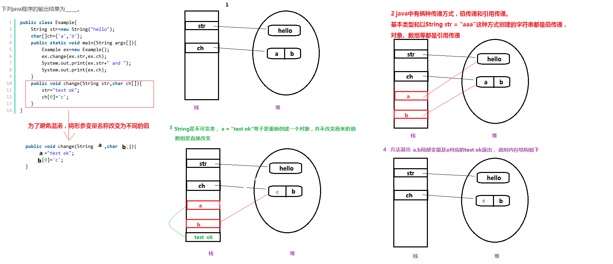

<blockquote class="blockquote-center">** 要每天都有收获**</blockquote>

<!-- more -->

### 局部类
匿名内部类用法与局部内部类不一致，首先从定义上就不一样，匿名类用在任何允许存在表达式的地方，而局部内部类用于在任何允许出现局部变量的地方出现。
静态内部类不能直接访问外部类的非静态成员，但可以通过new外部类（）.成员的方式访问。
 

### Collection接口
 
 
 
### 类方法
有如下一些限制：

1 在类方法中不能引用对象变量。
2 在类方法中不能使用super、this关键字。
3 类方法不能调用类中的对象方法。
与类方法相比，实例方法几乎没有什么限制：
1 实例方法可以引用对象变量（这是显然的），也可以引用类变量。
2 实例方法中可以使用super、this关键字。
3 实例方法中可以调用类方法。 

### 抽象类和接口

特点:
1.抽象类中可以构造方法
2.抽象类中可以存在普通属性，方法，静态属性和方法。
3.抽象类中可以存在抽象方法。
4.如果一个类中有一个抽象方法，那么当前类一定是抽象类；抽象类中不一定有抽象方法。
5.抽象类中的抽象方法，需要有子类实现，如果子类不实现，则子类也需要定义为抽象的。
6,抽象类不能被实例化，抽象类和抽象方法必须被abstract修饰

关键字使用注意：
抽象类中的抽象方法（其前有abstract修饰）不能用private、static、synchronized、native访问修饰符修饰。
接口

1.在接口中只有方法的声明，没有方法体。
2.在接口中只有常量，因为定义的变量，在编译的时候都会默认加上public static final，接口中的变量默认是public static final 的，方法默认是public abstract 的
3.在接口中的方法，永远都被public来修饰。
4.接口中没有构造方法，也不能实例化接口的对象。（所以接口不能继承类）
5.接口可以实现多继承
6.接口中定义的方法都需要有实现类来实现，如果实现类不能实现接口中的所有方法则实现类定义为抽象类。
7.接口可以继承接口，用extends

### 构造过程
class A{
    static {
        System.out.println("父类静态代码块");
    }
    public A(){
        System.out.println("父类构造方法");
    }
    {
        System.out.println("父类初始化块");
    }
}
public class B extends A{
    static{
        System.out.println("子类静态代码块");
    }
    public B(){
        System.out.println("子类构造方法");
    }
    {
        System.out.println("子类初始化块");
    }
    public static void main(String[] args){
        new B();
    }
}
父类静态代码块-->子类静态代码块-->父类普通代码块-->父类构造方法-->子类代码块-->子类构造方法；

### object类的方法： 
 

### final
 final修饰类、方法、属性！不能修饰抽象类，因为抽象类一般都是需要被继承的，final修饰后就不能继承了。
final修饰的方法不能被重写而不是重载！ 
final修饰属性，此属性就是一个常量，不能被再次赋值！

###  for循环的执行顺序
用如下表达式：
for(expression1;expression2;expression3){
expression4;
}
执行的顺序应该是：
1）第一次循环，即初始化循环。
首先执行表达式expression1（一般为初始化语句）；再执行expression2（一般为条件判断语句），判断expression1是否符合expression2的条件；如果符合，则执行expression4，否则，停止执行；最后执行expression3。

2）第N（N>=2）次循环
首先执行expression2，判断在expression3是否符合在expression2要求；如果符合，则继续执行在expression4，否则，停止执行。最后执行在expression3。如此往复，直至expression3不满足在expression2条件是为止。

总结：
总的来说，执行的顺序是一致的。先条件判断（expression2），再函数体执行（expression4），最后for执行（expression3）。往复......区别在于，条件判断的对象。第一次判断时，对象为初始化语句（expression1），后续的判断对象为执行后的结果（expression3）。 
### volatile
 一旦一个共享变量（类的成员变量、类的静态成员变量）被volatile修饰之后，那么就具备了两层语义：
1）保证了不同线程对这个变量进行操作时的可见性，即一个线程修改了某个变量的值，这新值对其他线程来说是立即可见的。
2）禁止进行指令重排序。
volatile只提供了保证访问该变量时，每次都是从内存中读取最新值，并不会使用寄存器缓存该值——每次都会从内存中读取。
而对该变量的修改，volatile并不提供原子性的保证。
由于及时更新，很可能导致另一线程访问最新变量值，无法跳出循环的情况
多线程下计数器必须使用锁保护。 
### Boolean
Boolean修饰的变量为包装类型，初始化值为false,进行赋值时会调用Boolean.valueOf(boolean b)方法自动拆箱为基本数据类型，因此赋值后flag值为true，输出文本true。 如果使用==比较,则输出文本false。if的语句比较，除boolean外的其他类型都不能使用赋值语句，否则会提示无法转成布尔值。 

### String 类
 
### finally语句块:
结论：
1、不管有木有出现异常，finally块中代码都会执行；
2、当try和catch中有return时，finally仍然会执行；
3、finally是在return后面的表达式运算后执行的（此时并没有返回运算后的值，而是先把要返回的值保存起来，管finally中的代码怎么样，返回的值都不会改变，任然是之前保存的值），所以函数返回值是在finally执行前确定的；
4、finally中最好不要包含return，否则程序会提前退出，返回值不是try或catch中保存的返回值。
举例：
情况1：try{} catch(){}finally{} return;
显然程序按顺序执行。

情况2:try{ return; }catch(){} finally{} return;
程序执行try块中return之前（包括return语句中的表达式运算）代码；
再执行finally块，最后执行try中return;
finally块之后的语句return，因为程序在try中已经return所以不再执行。

情况3:try{ } catch(){return;} finally{} return;
程序先执行try，如果遇到异常执行catch块，
有异常：则执行catch中return之前（包括return语句中的表达式运算）代码，再执行finally语句中全部代码，
最后执行catch块中return. finally之后也就是4处的代码不再执行。
无异常：执行完try再finally再return.

情况4:try{ return; }catch(){} finally{return;}
程序执行try块中return之前（包括return语句中的表达式运算）代码；
再执行finally块，因为finally块中有return所以提前退出。

情况5:try{} catch(){return;}finally{return;}
程序执行catch块中return之前（包括return语句中的表达式运算）代码；
再执行finally块，因为finally块中有return所以提前退出。

情况6:try{ return;}catch(){return;} finally{return;}
程序执行try块中return之前（包括return语句中的表达式运算）代码；
有异常：执行catch块中return之前（包括return语句中的表达式运算）代码；
则再执行finally块，因为finally块中有return所以提前退出。
无异常：则再执行finally块，因为finally块中有return所以提前退出。

最终结论：任何执行try 或者catch中的return语句之前，都会先执行finally语句，如果finally存在的话。
如果finally中有return语句，那么程序就return了，所以finally中的return是一定会被return的，
编译器把finally中的return实现为一个warning。

### Java表达式转型规则由低到高转换：
1、所有的byte,short,char型的值将被提升为int型；
2、如果有一个操作数是long型，计算结果是long型；
3、如果有一个操作数是float型，计算结果是float型；
4、如果有一个操作数是double型，计算结果是double型；
5、被fianl修饰的变量不会自动改变类型，当2个final修饰相操作时，结果会根据左边变量的类型而转化

### Socket
 ServerSocket(int port) 是服务端绑定port端口，调accept()监听等待客户端连接，它返回一个连接队列中的一个socket。
Socket(InetAddress address , int port)是创建客户端连接主机的socket流，其中InetAddress是用来记录主机的类，port指定端口。

socket和servletSocket的交互如下图所示：
 
[参考链接](http://www.cnblogs.com/rond/p/3565113.html) 
### JSP内置对象

1.request对象
     客户端的请求信息被封装在request对象中，通过它才能了解到客户的需求，然后做出响应。它是HttpServletRequest类的实例。
2.response对象
     response对象包含了响应客户请求的有关信息，但在JSP中很少直接用到它。它是HttpServletResponse类的实例。
3.session对象
     session对象指的是客户端与服务器的一次会话，从客户连到服务器的一个WebApplication开始，直到客户端与服务器断开连接为止。它是HttpSession类的实例.
4.out对象
     out对象是JspWriter类的实例,是向客户端输出内容常用的对象
5.page对象
     page对象就是指向当前JSP页面本身，有点象类中的this指针，它是java.lang.Object类的实例
6.application对象
     application对象实现了用户间数据的共享，可存放全局变量。它开始于服务器的启动，直到服务器的关闭，在此期间，此对象将一直存在；这样在用户的前后连接或不同用户之间的连接中，可以对此对象的同一属性进行操作；在任何地方对此对象属性的操作，都将影响到其他用户对此的访问。服务器的启动和关闭决定了application对象的生命。它是ServletContext类的实例。
7.exception对象
   exception对象是一个例外对象，当一个页面在运行过程中发生了例外，就产生这个对象。如果一个JSP页面要应用此对象，就必须把isErrorPage设为true，否则无法编译。他实际上是java.lang.Throwable的对象
8.pageContext对象
pageContext对象提供了对JSP页面内所有的对象及名字空间的访问，也就是说他可以访问到本页所在的SESSION，也可以取本页面所在的application的某一属性值，他相当于页面中所有功能的集大成者，它的本 类名也叫pageContext。
9.config对象
config对象是在一个Servlet初始化时，JSP引擎向它传递信息用的，此信息包括Servlet初始化时所要用到的参数（通过属性名和属性值构成）以及服务器的有关信息（通过传递一个ServletContext对象）

### 面向对象五大基本原则
五个基本原则：
单一职责原则（Single-Resposibility Principle）：一个类，最好只做一件事，只有一个引起它的变化。单一职责原则可以看做是低耦合、高内聚在面向对象原则上的引申，将职责定义为引起变化的原因，以提高内聚性来减少引起变化的原因。
开放封闭原则（Open-Closed principle）：软件实体应该是可扩展的，而不可修改的。也就是，对扩展开放，对修改封闭的。
Liskov替换原则（Liskov-Substituion Principle）：子类必须能够替换其基类。这一思想体现为对继承机制的约束规范，只有子类能够替换基类时，才能保证系统在运行期内识别子类，这是保证继承复用的基础。
依赖倒置原则（Dependecy-Inversion Principle）：依赖于抽象。具体而言就是高层模块不依赖于底层模块，二者都同依赖于抽象；抽象不依赖于具体，具体依赖于抽象。
接口隔离原则（Interface-Segregation Principle）：使用多个小的专门的接口，而不要使用一个大的总接口

### 小点

1.switch语句后的控制表达式只能是short、char、int、long整数类型和枚举类型，不能是float，double和boolean类型

2.捕获到的异常不仅可以在当前方法中处理，还可以将异常抛给调用它的上一级方法来处理。

3.HashMap的底层是由数组加链表实现的，对于每一个key值，都需要计算哈希值，然后通过哈希值来确定顺序，并不是按照加入顺序来存放的，因此可以认为是无序的，但不管是有序还是无序，它都一个自己的顺序。故A错。
最开始有Hashtable，Hashtable是不允许key和value的值为空的，但后来开发者认为有时候也会有key值为空的情况，因为可以允许null为空，通过查看HashMap的源代码就知道：if(key = null) {putForNullKey(value);};
Map底层都是用key/value键值对的形式存放的

4.Set 不能有重复的元素，且是无序的，要有空值也就只能有一个。因为它不允许重复。 L ist 可以有重复元素，且是有序的，要有空值也可以有多个，因为它可重复 
5.public Method[] getDeclaredMethods()返回类或接口声明的所有方法，包括public, protected, default (package) 访问和private方法的Method对象，但不包括继承的方法。当然也包括它所实现接口的方法。
public Method[] getMethods()返回类的所有public方法，包括其继承类的公用方法，当然也包括它所实现接口的方法。 

6.0xFFFFFFFFFFFFFFFF 转为源码 = -1

7.URL u =new URL(http://www.123.com).
如果 www.123.com 不存在，则返回 http://www.123.com

8.InputStreamReader可用于处理 Unicode，bufferedReader主要起装饰作用。

9.HashMap是线程安全的HashMap
Vector是线程安全的ArrayList
TreeSet和LinkedList都不是线程安全的 

10.Java一律采用Unicode编码方式，每个字符无论中文还是英文字符都占用2个字节。

11.不同的编码之间是可以转换的，通常流程如下：
将字符串S以其自身编码方式分解为字节数组，再将字节数组以你想要输出的编码方式重新编码为字符串。
例：String newUTF8Str = new String(oldGBKStr.getBytes("GBK"), "UTF8");

12.Java虚拟机中通常使用UTF-16的方式保存一个字符

13.ResourceBundle能够依据Local的不同，选择性的读取与Local对应后缀的properties文件，以达到国际化的目的。

14.Math.cos为计算弧度的余弦值，Math.toRadians函数讲角度转换为弧度
double d=Math.cos（Math.toDegrees（42））

15.hashcode和equals的约定关系如下：
  >   1、如果两个对象相等，那么他们一定有相同的哈希值（hash code）。
    2、如果两个对象的哈希值相等，那么这两个对象有可能相等也有可能不相等。（需要再通过equals来判断）
    
16.加载驱动方法
  >   1、Class.forName("com.microsoft.sqlserver.jdbc.SQLServerDriver");
    2、 DriverManager.registerDriver(new com.mysql.jdbc.Driver());
    3、System.setProperty("jdbc.drivers", "com.mysql.jdbc.Driver");
    
17.运算符中优先级最高:口诀：淡云一笔安洛三福 单目>算数运算符>移位>比较>按位>逻辑>三目>赋值 

18.所有异常都是Exception的子类

 19.String classFile = "com.jd.". replaceAll(".", "/") + "MyClass.class";
///////MyClass.class
由于replaceAll方法的第一个参数是一个正则表达式，而"."在正则表达式中表示任何字符，所以会把前面字符串的所有字符都替换成"/"。如果想替换的只是"."，那么久要写成"\\."

 20.注解
>  Override 注解
指明被注解的方法需要覆写超类中的方法.
如果某个方法使用了该注解,却没有覆写超类中的方法(比如大小写写错了,或者参数错了,或者是子类自己定义的方法),编译器就会生成一个错误.
Deprecated 注解
可以修饰类、方法、变量，在java源码中被@Deprecated修饰的类、方法、变量等表示不建议使用的，可能会出现错误的，可能以后会被删除的类、方法等，如果现在使用，则在以后使用了这些类、方法的程序在更新新的JDK、jar包等就会出错，不再提供支持。     个人程序中的类、方法、变量用@Deprecated修饰同样是不希望自己和别人在以后的时间再次使用此类、方法。  当编译器编译时遇到了使用@Deprecated修饰的类、方法、变量时会提示相应的警告信息。
Suppresswarnings 注解
可以达到抑制编译器编译时产生警告的目的，但是很不建议使用@SuppressWarnings注解，使用此注解，编码人员看不到编译时编译器提示的相应的警告，不能选择更好、更新的类、方法或者不能编写更规范的编码。同时后期更新JDK、jar包等源码时，使用@SuppressWarnings注解的代码可能受新的JDK、jar包代码的支持，出现错误，仍然需要修改。 

21.两个数值进行二元操作时，会有如下的转换操作：如果两个操作数其中有一个是double类型，另一个操作就会转换为double类型。否则，如果其中一个操作数是float类型，另一个将会转换为float类型。否则，如果其中一个操作数是long类型，另一个会转换为long类型。否则，两个操作数都转换为int类型。 

22.
 

23.sleep()是Thread类中的方法，而wait()则是Object类中的方法。
sleep()方法导致了程序暂停，但是他的监控状态依然保持着，当指定的时间到了又会自动恢复运行状态。在调用sleep()方法的过程中，线程不会释放对象锁。
wait()方法会导致线程放弃对象锁，进入等待此对象的等待锁定池，只有针对此对象调用notify()方法后本线程才进入对象锁定池准备获取对象锁进入运行状态。注意是准备获取对象锁进入运行状态，而不是立即获得

24.Arrays.asList()将一个数组转化为一个List对象，这个方法会返回一个ArrayList类型的对象， 这个ArrayList类并非java.util.ArrayList类，而是Arrays类的静态内部类！用这个对象对列表进行添加删除更新操作，就会报UnsupportedOperationException异常。

25.hashMap在单线程中使用大大提高效率，在多线程的情况下使用hashTable来确保安全。hashTable中使用synchronized关键字来实现安全机制，但是synchronized是对整张hash表进行锁定即让线程独享整张hash表，在安全同时造成了浪费。concurrentHashMap采用分段加锁的机制来确保安全

26.Properties 继承了Hashtable，因为Hashtable是线程安全的，所以Properties是线程安全的，StringBuffer是线程安全的，相当于一个线程安全的StringBuilder，Arraylist是非线程安全的，其对应的线程安全类是Vector

27.
 