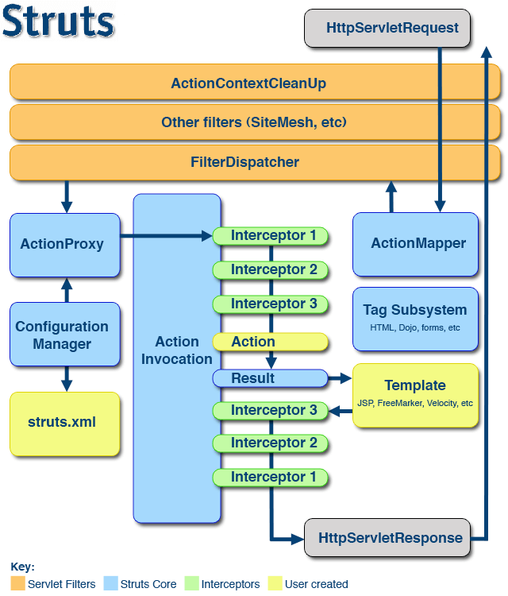

 <!-- more -->
# struts2概述
struts2框架应用javaee三层结构中web层框架
struts2框架在struts1和webwork基础之上发展全新框架
用servlet和struts框架的基本比较

web层框架：1.struts 2.spring

# struts2入门案例
1.每次访问servlet时候，都会执行service方法
 写类继承HttpServlet，重写类里面的方法
 在web.xml中配置servlet访问路径
2.每次访问action时候，默认执行execute方法
 配置action访问路径
## 第一步 导入jar包
1.在lib中jar包，不能把这些jar都导入到项目中
2.到apps目录里面，找到实例程序，从示例程序中复制相关的jar包
## 第二步 创建action

## 第三步 配置action类访问路径
1.创建struts2核心配置文件
 	核心配置文件吗名称和位置是固定的
    位置必须在src下面，名称struts.xml
2.引入dtd约束

3.action配置

## 第四步 配置struts2过滤器

根据配置显示的是相应的hello.jsp文件

# 基本执行过程

过滤器在服务器启动时候创建，创建过滤器时候执行init方法，在init方法中主要加载配置文件，包含自己创建的和struts2自带的配置文件struts.xml和web.xml
# 常见多变的方法
## 动态方法的调用
动态方法调用就是为了解决一个Action对应多个请求的处理，以免Action太多
通常有三种方式：
> 指定method属性
感叹号方式（不推荐）
通配符方式

## 接收参数
> 使用Action的属性接收参数
使用DomainModel接收参数
使用ModelDriven接收参数
## 处理结果类型
> 局部结果
将<result/>作为<action/>元素的子元素配置
全局结果
将<result/>作为<global-result/>元素的子元素配置

## Action三种创建方式
> 创建普通类，不继承任何类，不实现任何接口
创建类，实现接口Action
创建类，继承类ActionSupport(一般使用这种方式)

# 获取表单数据
## 使用ActionContext(推荐)

## 使用ServletActionContext类

## 使用接口注入方式

# ServletAPI解藕方式
 为了避免与Servlet API耦合在一起，方便Action类做单元测试，Struts2对HttpServletRequest、 HttpSession和ServletContext进行了封装，构造了三个Map对象来替代这三种对象。可以通过com.opensymphony.xwork2.ActionContext类来得到这三个对象。ActionContext是 Action执行的上下文，保存了很多对象如parameters、request、session、application和locale等。
 ## 获取request、session等方法
创建方式
 ~~~
Map<String,Object> attributes = ActionContext.getContext().getSession();
~~~
或者
 ~~~
ActionContext context = ActionContext.getContext();
Map<String, Object> session = context.getSession();
~~~

 ~~~
session.put("str2", str1);
~~~
意思是将str1这个变量的内容赋给str2这个变量
在jsp中有两种输出方式（大致上没有区别，除非对应直接输入，会有一定的差别）
 ~~~
     ${requestScope.str2}  
    <%= ActionContext.getContext().get("str2") %>  
~~~
参考网址：
https://www.yiibai.com/struts_2/
https://www.w3cschool.cn/struts_2/

