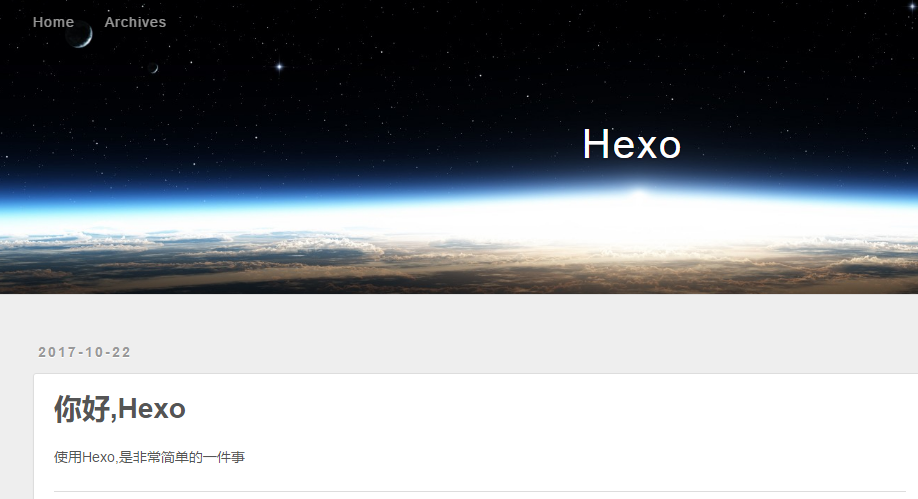

## 菜鸟初步搭建须知（是我没错，备忘）

### 相应知识
 * 会一些基本的Linux命令和vim的操作命令。可以在[实验楼](https://www.shiyanlou.com/)上入门学习
 * 网上已经浏览了 [官方文档](https://hexo.io/zh-cn/)
 * 安装ubuntu和git（因为最近在学习用ubuntu，而且很多操作ubuntu上会更简单）
 * 安装Node.js并拥有github账号
 * github上新建好一个专门的仓库，并最好熟悉github及其基本操作比如SSH密钥
  <!-- more -->
 * 以上知识网上有比较完善的信息，搜索关键字学习并进行必要的搭建前提已经完成下图：
  

 建议大家选择不同的博客建站，可以参考[有哪些好看的 Hexo 主题?](https://www.zhihu.com/question/24422335)

### 新手初步搭建可能有用
搭建nexT主题可能有帮助的链接：
 https://www.cnblogs.com/fengxiongZz/p/7707219.html
 https://www.jianshu.com/p/a0a27d840992
 https://www.jianshu.com/p/24cb74aeb0a3
 http://www.cnblogs.com/liuxianan/p/build-blog-website-by-hexo-github.html
 

## 深入搭建，安装NexT主题

Hexo 安装主题的方式非常简单，新建blog文档（命名随意）在其下打开终端操作即可，具体到 NexT 来说，安装步骤如下。

### 安装主题

```bash
$ git clone https://github.com/iissnan/hexo-theme-next themes/next
```
具体还有以下步骤（自行网上搜索）：

* hexo init(第一次需要)
* hexo clean
* hexo g
* hexo s
* hexo d

### 启动主题
与所有 Hexo 主题启用的模式一样。 当 克隆/下载 完成后，打开 站点配置文件（官方文档中给出站点配置文件解释）， ctrl+f 搜索到 theme 字段，并将其值更改为 next，主题默认为landscape，建议选择Pisces或Gemini

```bash
theme: next
```

### 验证主题

首先启动 Hexo 本地站点，并开启调试模式（即加上 --debug，dubug会帮助你更好找到安装过程的错误），整个命令是 hexo s --debug。 在服务启动的过程，注意观察命令行输出是否有任何异常信息，如果你碰到问题，这些信息将帮助他人更好的定位错误。 当命令行输出中提示出：

```bash
INFO  Hexo is running at http://localhost:4000/. Press Ctrl+C to stop.
```

## 改动hexo 站点配置文件
	

***我们打开站点下的_config.yml文件***
### 深入站点配置文件，事先变动
***RSS订阅***
	
1.在hexo的根目录下执行命令：
 ```bash
  npm install hexo-generator-feed --save
  ```
  2在根目录下的/theme/next/_config.yml文件中添加配置
 ```bash
feed:
    type: rss2
    path: rss2.xml
    limit: 5
    hub:
    content: 'true'
  ```
  ***加入站点内容搜索功能***
  1.安装hexo-generator-searchdb 注意：安装时应在站点根目录下，即blog目录下
 ```bash
$ npm install hexo-generator-searchdb --save
  ```
  2.添加search字段，在站点blog/_config.yml中添加search字段，如下
 ```bash
search:
  path: search.xml
  field: post
  format: html
  limit: 10000
  ```
  ***编辑远程部署 ，添加代码块***
   ```bash
deploy: 
  type: git
  repository: https://github.com/Thunderforrain/Thunderforrain.github.io.git
  branch: master
  ```
  ***方便写博客，自动生成图片文档***
   ```bash
post_asset_folder: true    如果是flase 改成true
  ```
  参考[文章内添加图片](https://blog.csdn.net/Android_MSK/article/details/75040841)
  
***注意 :***
*** : ***使用英文的，并且后面要有空格

### 执行完以上步骤，查找关键字来更改其他信息，最后结果大致如下(仅作最后的参考)

```bash
# Hexo Configuration
## Docs: https://hexo.io/docs/configuration.html
## Source: https://github.com/hexojs/hexo/
# Site 网站
title: Thunderforrain's Blog #网站标题
subtitle: 实迷途其未远,觉今是而昨非 #网站副标题
description: 菜鸟的 尝试，笨鸟的先飞 #网站描述

keywords:
author: Thunderforrain  #博主的名字
language: zh-Hans  #网站使用的语言
timezone:      #网站时区。Hexo 默认使用您电脑的时区

# URL 网址 
## If your site is put in a subdirectory, set url as 'http://yoursite.com/child' and root as '/child/'
url: https://thunderforrain.github.io/ **  #你网站的url
root: /blog/ #子目录
permalink: :year/:month/:day/:title/    #生成文件名字的格式
permalink_defaults:

# Directory 目录配置
source_dir: source 
public_dir: public
tag_dir: tags
archive_dir: archives
category_dir: categories
code_dir: downloads/code
i18n_dir: :lang
skip_render:
# Writing 文章
new_post_name: :title.md   # File name of new posts （新建文章链接形式）
default_layout: post   # 默认布局（官方文档中给出其他布局）
titlecase: false   # Transform title into titlecase
external_link: true  # Open external links in new tab
filename_case: 0 
render_drafts: false 
post_asset_folder: true  #启动 Asset 文件夹,方便管理文章图片
relative_link: false 
future: true 
highlight:  #代码块设为true
  enable: true
  line_number: true
  auto_detect: false
  tab_replace:
  
  # Home page setting
# path: Root path for your blogs index page. (default = '')
# per_page: Posts displayed per page. (0 = disable pagination)
# order_by: Posts order. (Order by date descending by default)
index_generator:
  path: ''
  per_page: 10
  order_by: -date
  
# Category & Tag
default_category: uncategorized
category_map:
tag_map: 
# Date / Time format
## Hexo uses Moment.js to parse and display date
## You can customize the date format as defined in
## http://momentjs.com/docs/#/displaying/format/
date_format: YYYY-MM-DD
time_format: HH:mm:ss

# Pagination 分页（非全屏不显示）
## Set per_page to 0 to disable pagination
per_page: 10   #每页显示的文章量 (0 = 关闭分页功能)
pagination_dir: page 

search:
  path: search.xml
  field: post
  format: html
  limit: 10000

# Extensions
## Plugins: https://hexo.io/plugins/
## Themes: https://hexo.io/themes/
theme: next
## Rss订阅
plugin:
- hexo-generator-feed
#Feed Atom
feed:
  type: atom       #feed 类型 (atom/rss2)
  path: atom.xml   #rss 路径
  limit: 20        #在 rss 中最多生成的文章数(0显示所有)
  hub:
  content:
  content_limit: 140
  content_limit_delim: ' '
  order_by: -date
# Deployment
## Docs: https://hexo.io/docs/deployment.html
deploy: 
type: git 
  repository: git@github.com:Tenke007/Tenke007.github.io.git
  branch: master
```
## 改动hexo 主题配置文件

### 建议参考网址，网上有比较好的教程:
[Never_yu's Blog](https://neveryu.github.io/categories/Hexo/)
[主题配置参考](https://github.com/iissnan/hexo-theme-next/wiki/%E4%B8%BB%E9%A2%98%E9%85%8D%E7%BD%AE%E5%8F%82%E8%80%83)
[知了笔记](https://www.aisun.org/categories/hexo/)
[Elegant theme for Hexo](https://github.com/iissnan/hexo-theme-next)
建议看一下我下一篇[博客](https://thunderforrain.github.io/posts/dde90a5c/#more)
***我们打开主题下的_config.yml文件***

### 深入主题配置文件，里面可以添加很多东西（参考上述网址）：

 * 在右上角或者左上角实现fork me on github
 * 背景配置
 * 添加动态背景
 * 实现点击出现桃心效果
 * 修改文章内链接文本样式
 * 修改文章底部的那个带#号的标签
 * 在每篇文章末尾统一添加“本文结束”标记
 * 修改作者头像并旋转
 * 博文压缩
 * 修改“代码块自定义样式
 * 侧边栏社交小图标设置
 * 主页文章添加阴影效果
 * 在网站底部加上访问量
 * 添加热度
 * 网站底部字数统计
 * 添加 README.md 文件
 * 设置网站的图标Favicon
 * 实现统计功能
 * 添加顶部加载条
 * 在文章底部增加版权信息
 * 添加Gitment评论系统
 * 隐藏网页底部powered By Hexo / 强力驱动
 * 修改网页底部的桃心
 * 文章加密访问
 * 添加jiathis分享
 * 博文置顶
 * 修改字体大小
 * 修改打赏字体不闪动
 * 侧边栏推荐阅读
 * 自定义鼠标样式
 * hexo 添加百度站长推送
 * hexo NexT主题首页title链接的优化
 * Hexo NexT主题修改文章标题样式
 * hexo 添加百度站长推送

参考上文知了笔记的[hexo框架基于next主题定制](https://www.aisun.org/2017/10/hexo-next+dingzhi/)

### 下文可作为理解帮助（仅作为最后的参考）:
```bash
# ---------------------------------------------------------------
# Site Information Settings
# ---------------------------------------------------------------

# For example, you put your favicons into `hexo-site/source/images` directory.
# Then need to rename & redefine they on any other names, otherwise icons from Next will rewrite your custom icons in Hexo
favicon: ##网站的头像
  small: /images/avatar.jpg
  medium: /images/avatar.jpg
  apple_touch_icon: /images/apple-touch-icon-next.png
  safari_pinned_tab: /images/logo.svg
  #android_manifest: /images/manifest.json
  #ms_browserconfig: /images/browserconfig.xml

# Set default keywords (Use a comma to separate)
keywords: "记录耕耘"##网站关键字

# Set rss to false to disable feed link.
# Leave rss as empty to use site's feed link.
# Set rss to specific value if you have burned your feed already.
rss: /atom.xml # 需要安装插件

# Specify the date when the site was setup
since: 2015 网站时间，类似 2015-2016

 # Icon between year and copyright info.
  icon: user

  # If not defined, will be used `author` from Hexo main config.
  copyright: #我的是自己设置可否评论，可以使用统一u形式，不同的评论方式不同
  # -------------------------------------------------------------
  # Hexo link (Powered by Hexo).#管理底部驱动信息，个人去了版本号
  powered: true 

  theme:
    # Theme & scheme info link (Theme - NexT.scheme).
    enable: true
    # Version info of NexT after scheme info (vX.X.X).
    version: false
  # -------------------------------------------------------------
  # Any custom text can be defined here.
  #custom_text: Hosted by <a target="_blank" href="https://pages.github.com">GitHub Pages</a>

# ---------------------------------------------------------------
# SEO Settings
# ---------------------------------------------------------------

# Canonical, set a canonical link tag in your hexo, you could use it for your SEO of blog.
# See: https://support.google.com/webmasters/answer/139066
# Tips: Before you open this tag, remeber set up your URL in hexo _config.yml ( ex. url: http://yourdomain.com )
canonical: true

# Change headers hierarchy on site-subtitle (will be main site description) and on all post/pages titles for better SEO-optimization.
seo: false

# If true, will add site-subtitle to index page, added in main hexo config.
# subtitle: Subtitle
index_with_subtitle: false

# ---------------------------------------------------------------
# Menu Settings
# ---------------------------------------------------------------

# When running the site in a subdirectory (e.g. domain.tld/blog), remove the leading slash from link value (/archives -> archives).
# Usage: `Key: /link/ || icon`
# Key is the name of menu item. If translate for this menu will find in languages - this translate will be loaded; if not - Key name will be used. Key is case-senstive.
# Value before `||` delimeter is the target link.
# Value after `||` delimeter is the name of FontAwesome icon. If icon (with or without delimeter) is not specified, question icon will be loaded.
menu: #菜单路径设置 如果hexo在二级目录放置要去掉/
  home: /
  categories: /categories #分类
  tags: /tags #标签
  archives: /archives #归档
  #about: /about # 关于我
  #sitemap: /sitemap.xml #这个可以不用开启，给搜索引擎用的，需要安装插件
  #commonweal: /404.html #公益404

# Enable/Disable menu icons.
# Icon Mapping:
#   Map a menu item to a specific FontAwesome icon name.
#   Key is the name of menu item and value is the name of FontAwsome icon. Key is case-senstive.
#   When an question mask icon presenting up means that the item has no mapping icon.
menu_icons: #上面menu的icon
menu_icons:
  enable: true
  home: home
  about: user
  categories: th
  tags: tags
  archives: archive
  commonweal: heartbeat

# ---------------------------------------------------------------
# Scheme Settings
# ---------------------------------------------------------------

# Schemes  #next主题的三个schemes(默认是Muse)
#scheme: Muse
#scheme: Mist
#scheme: Pisces
scheme: Gemini #个人比较喜欢Gemini

# ---------------------------------------------------------------
# Sidebar Settings
# ---------------------------------------------------------------


# Social Links.
# Usage: `Key: permalink || icon`
# Key is the link label showing to end users.
# Value before `||` delimeter is the target permalink.
# Value after `||` delimeter is the name of FontAwesome icon. If icon (with or without delimeter) is not specified, globe icon will be loaded.
#social: #社交链接，可以放github,weibo,qq等
  GitHub: https://github.com/Thunderforrain || github
  CSDN: https://blog.csdn.net/Thunderforrain
  #微博: 
  #E-Mail: mailto:yourname@gmail.com || envelope
  #Google: https://plus.google.com/yourname || google
  #Twitter: https://twitter.com/yourname || twitter
  #FB Page: https://www.facebook.com/yourname || facebook
  #VK Group: https://vk.com/yourname || vk
  #StackOverflow: https://stackoverflow.com/yourname || stack-overflow
  #YouTube: https://youtube.com/yourname || youtube
  #Instagram: https://instagram.com/yourname || instagram
  #Skype: skype:yourname?call|chat || skype
  
social_icons: #对应的社交icon
  enable: true
  # Icon Mappings.
  # KeyMapsToSocalItemKey: NameOfTheIconFromFontAwesome
  GitHub: github
  Twitter: twitter
  Weibo: weibo
  Wechat: wechat

# Blog rolls #相关链接
links_icon: link
links_title: 友情链接
links: 
   git学习: http://github.phodal.com/
   馨客栈: http://www.mackxin.com/
   CSL's Blog 的链接: http://cubercsl.cn/links/
   jacklightChen's Blog: http://blog.lightina.cn/
links_layout: block

  #Title: http://example.com/
# Sidebar Avatar
# in theme directory(source/images): /images/avatar.jpg
# in site  directory(source/uploads): /uploads/avatar.jpg
avatar: /images/avatar.jpg #博主头像（可以放外链）


# Table Of Contents in the Sidebar #文章自动显示目录
toc:
  enable: true

  # Automatically add list number to toc. #目录是否自动显示数字序号
  number: true

  # If true, all words will placed on next lines if header width longer then sidebar width.
  wrap: false

# Creative Commons 4.0 International License.
# http://creativecommons.org/
# Available: by | by-nc | by-nc-nd | by-nc-sa | by-nd | by-sa | zero
#creative_commons: by-nc-sa
#creative_commons:


sidebar: #侧边栏，只对Pisces、Gemini有效
  # Sidebar Position, available value: left | right (only for Pisces | Gemini).
  position: left
  #position: right

  # Sidebar Display, available value:
  #  - post    expand on posts automatically. Default.
  #  - always  expand for all pages automatically
  #  - hide    expand only when click on the sidebar toggle icon.
  #  - remove  Totally remove sidebar including sidebar toggler.
  display: post
  #display: always
  #display: hide
  #display: remove

  # Sidebar offset from top menubar in pixels (only for Pisces | Gemini).像素菜单条边栏偏移量
  offset: 12

  # Back to top in sidebar (only for Pisces | Gemini).
  b2t: false

  # Scroll percent label in b2t button.
  scrollpercent: false

  # Enable sidebar on narrow view (only for Muse | Mist).
  
  onmobile: false

# ---------------------------------------------------------------
# Post Settings
# ---------------------------------------------------------------

# Automatically scroll page to section which is under <!-- more --> mark.
scroll_to_more: true

# Automatically excerpt description in homepage as preamble text.
excerpt_description: true

# Automatically Excerpt. Not recommand.
# Please use <!-- more --> in the post to control excerpt accurately.
auto_excerpt: #设置为true,首页文章会显示 阅读全文，建议使用 <!-- more -->
  enable: true
  length: 150

# Post meta display settings
post_meta:
  item_text: true
  created_at: true
  updated_at: false
  categories: true


# Wechat Subscriber #文章内显示微信二维码
wechat_subscriber:
  enabled: true
  qcode: /images/wechat.png #微信二维码图片路径
  description: 随便说点 #微信二维码描述

#Reward #打赏功能，图片相应目录有或者外链
reward_comment: 捐助菜鸡，提携笨鸟
wechatpay: /images/wechatpay.png
alipay: /images/alipay.jpg
#bitcoin: /images/bitcoin.png

# Declare license on posts # 版权声明
post_copyright:
  enable: false
  license: CC BY-NC-SA 3.0
  license_url: https://creativecommons.org/licenses/by-nc-sa/3.0/


# ---------------------------------------------------------------
# Misc Theme Settings
# ---------------------------------------------------------------

# Reduce padding / margin indents on devices with narrow width.
mobile_layout_economy: false

# Android Chrome header panel color ($black-deep).
android_chrome_color: "#222"

# Custom Logo.
# !!Only available for Default Scheme currently.
# Options:
#   enabled: [true/false] - Replace with specific image
#   image: url-of-image   - Images's url
custom_logo:
  enabled: false
  image:


# Code Highlight theme 代码高丽风格，个人喜欢默认版本
# Available value:
#    normal | night | night eighties | night blue | night bright
# https://github.com/chriskempson/tomorrow-theme
highlight_theme: normal


# ---------------------------------------------------------------
# Font Settings
# - Find fonts on Google Fonts (https://www.google.com/fonts)
# - All fonts set here will have the following styles:
#     light, light italic, normal, normal italic, bold, bold italic
# - Be aware that setting too much fonts will cause site running slowly
# - Introduce in 5.0.1
# ---------------------------------------------------------------
# CAUTION! Safari Version 10.1.2 bug: https://github.com/iissnan/hexo-theme-next/issues/1844
# To avoid space between header and sidebar in Pisces / Gemini themes recommended to use Web Safe fonts for `global` (and `logo`):
# Arial | Tahoma | Helvetica | Times New Roman | Courier New | Verdana | Georgia | Palatino | Garamond | Comic Sans MS | Trebuchet MS
# ---------------------------------------------------------------
font:
  enable: false

  # Uri of fonts host. E.g. //fonts.googleapis.com (Default).
  host:

  # Font options:
  # `external: true` will load this font family from `host` above.
  # `family: Times New Roman`. Without any quotes.
  # `size: xx`. Use `px` as unit.

  # Global font settings used on <body> element.
  global:
    external: true
    family: Lato
    size:

  # Font settings for Headlines (h1, h2, h3, h4, h5, h6).
  # Fallback to `global` font settings.
  headings:
    external: true
    family:
    size:

  # Font settings for posts.
  # Fallback to `global` font settings.
  posts:
    external: true
    family:

  # Font settings for Logo.
  # Fallback to `global` font settings.
  logo:
    external: true
    family:
    size:

  # Font settings for <code> and code blocks.
  codes:
    external: true
    family:
    size:
    
# ---------------------------------------------------------------
# Third Party Services Settings
# ---------------------------------------------------------------

# MathJax Support
mathjax:
  enable: false
  per_page: false
  cdn: //cdn.mathjax.org/mathjax/latest/MathJax.js?config=TeX-AMS-MML_HTMLorMML


# Swiftype Search API Key #第三方搜索（根据喜好选择，不举例了）
#swiftype_key:

# Baidu Analytics ID #百度分析
#baidu_analytics:

# Duoshuo ShortName #多说评论，已成为过去，不可使用
duoshuo_shortname: tenke

# Disqus #来必力评论
#disqus_shortname:

# changyan #畅言评论
changyan:
  enable: false
  appid:
  appkey:
  
# Hypercomments
#hypercomments_id:

# Valine.
# You can get your appid and appkey from https://leancloud.cn
# more info please open https://valine.js.org
valine: #下面有东西，暂不举例，涉及隐私
  
# Gitment #需要github账号才能留言
# Introduction: https://imsun.net/posts/gitment-introduction/
# You can get your Github ID from https://api.github.com/users/<Github username>
gitment:
  enable: false
  mint: true # RECOMMEND, A mint on Gitment, to support count, language and proxy_gateway
  count: true # Show comments count in post meta area
  lazy: false # Comments lazy loading with a button
  cleanly: false # Hide 'Powered by ...' on footer, and more
  language: # Force language, or auto switch by theme
  github_user: # MUST HAVE, Your Github ID
  github_repo: # MUST HAVE, The repo you use to store Gitment comments
  client_id: # MUST HAVE, Github client id for the Gitment
  client_secret: # EITHER this or proxy_gateway, Github access secret token for the Gitment
  proxy_gateway: # Address of api proxy, See: https://github.com/aimingoo/intersect
  redirect_protocol: # Protocol of redirect_uri with force_redirect_protocol when mint enabled
:

# Baidu Share
# Available value:
#    button | slide
# Warning: Baidu Share does not support https.
#baidushare:
##  type: button

# Share
# This plugin is more useful in China, make sure you known how to use it.
# And you can find the use guide at official webiste: http://www.jiathis.com/.
# Warning: JiaThis does not support https.
#jiathis:
  ##uid: Get this uid from http://www.jiathis.com/
#add_this_id:

# Share #废弃
duoshuo_share: true

# NeedMoreShare2
# This plugin is a pure javascript sharing lib which is useful in China.
# See: https://github.com/revir/need-more-share2
# Also see: https://github.com/DzmVasileusky/needShareButton
# iconStyle: default | box
# boxForm: horizontal | vertical
# position: top / middle / bottom + Left / Center / Right
# networks: Weibo,Wechat,Douban,QQZone,Twitter,Linkedin,Mailto,Reddit,
#           Delicious,StumbleUpon,Pinterest,Facebook,GooglePlus,Slashdot,
#           Technorati,Posterous,Tumblr,GoogleBookmarks,Newsvine,
#           Evernote,Friendfeed,Vkontakte,Odnoklassniki,Mailru
needmoreshare2:
  enable: false
  postbottom:
    enable: false
    options:
      iconStyle: box
      boxForm: horizontal
      position: bottomCenter
      networks: Weibo,Wechat,Douban,QQZone,Twitter,Facebook
  float:
    enable: false
    options:
      iconStyle: box
      boxForm: horizontal
      position: middleRight
      networks: Weibo,Wechat,Douban,QQZone,Twitter,Facebook

# Google Webmaster tools verification setting
# See: https://www.google.com/webmasters/
#google_site_verification:


# Google Analytics
#google_analytics:

# CNZZ count
#cnzz_siteid:

# Application Insights
# See https://azure.microsoft.com/en-us/services/application-insights/
# application_insights:

# Make duoshuo show UA
# user_id must NOT be null when admin_enable is true!
# you can visit http://dev.duoshuo.com get duoshuo user id.
duoshuo_info: #弃用
  ua_enable: true 
  admin_enable: true 
  user_id: 
  admin_nickname: 

# Post widgets & FB/VK comments settings.
# ---------------------------------------------------------------
# Facebook SDK Support.
# https://github.com/iissnan/hexo-theme-next/pull/410
facebook_sdk: #facebook相关
  enable:       false
  app_id:       #<app_id>
  fb_admin:     #<user_id>
  like_button:  #true
  webmaster:    #true
  
# Post widgets & FB/VK comments settings.
# ---------------------------------------------------------------
# Facebook SDK Support.
# https://github.com/iissnan/hexo-theme-next/pull/410
facebook_sdk:
  enable: false
  app_id:       #<app_id>
  fb_admin:     #<user_id>
  like_button:  #true
  webmaster:    #true

# Facebook comments plugin
# This plugin depends on Facebook SDK.
# If facebook_sdk.enable is false, Facebook comments plugin is unavailable.
facebook_comments_plugin:
  enable: false
  num_of_posts: 10  # min posts num is 1
  width: 100%       # default width is 550px
  scheme: light     # default scheme is light (light or dark)

# VKontakte API Support.
# To get your AppID visit https://vk.com/editapp?act=create
vkontakte_api:
  enable:       false
  app_id:       #<app_id>
  like:         true
  comments:     true
  num_of_posts: 10

# Star rating support to each article.
# To get your ID visit https://widgetpack.com
rating:
  enable: false
  id:     #<app_id>
  color:  fc6423
# --------------------------------------------------------------

# Show number of visitors to each article.
# You can visit https://leancloud.cn get AppID and AppKey.
leancloud_visitors:
  enable: false
  app_id: #<app_id>
  app_key: #<app_key>

# Another tool to show number of visitors to each article.
# visit https://console.firebase.google.com/u/0/ to get apiKey and projectId
# visit https://firebase.google.com/docs/firestore/ to get more information about firestore
firestore:
  enable: false
  collection: articles #required, a string collection name to access firestore database
  apiKey: #required
  projectId: #required
  bluebird: false #enable this if you want to include bluebird 3.5.1(core version) Promise polyfill


# Show PV/UV of the website/page with busuanzi.
# Get more information on http://ibruce.info/2015/04/04/busuanzi/
busuanzi_count: #第三方用户访问插件，直接开启，根据喜好添加文字
  # count values only if the other configs are false
  enable: true
  # custom uv span for the whole site
  site_uv: true
  site_uv_header: <i class="fa fa-user"></i>
  site_uv_footer:
  # custom pv span for the whole site
  site_pv: true
  site_pv_header: <i class="fa fa-eye"></i>
  site_pv_footer:
  # custom pv span for one page only
  page_pv: true
  page_pv_header: <i class="fa fa-file-o"></i>&nbsp&nbsp阅读数
  page_pv_footer:

# Tencent analytics ID
# tencent_analytics:

# Tencent MTA ID
# tencent_mta:

# Enable baidu push so that the blog will push the url to baidu automatically which is very helpful for SEO
baidu_push: false

# Google Calendar
# Share your recent schedule to others via calendar page
#
# API Documentation:
# https://developers.google.com/google-apps/calendar/v3/reference/events/list
calendar:
  enable: false
  calendar_id: <required>
  api_key: <required>
  orderBy: startTime
  offsetMax: 24
  offsetMin: 4
  timeZone:
  showDeleted: false
  singleEvents: true
  maxResults: 250

# Algolia Search
algolia_search:
  enable: false
  hits:
    per_page: 10
  labels:
    input_placeholder: Search for Posts
    hits_empty: "We didn't find any results for the search: ${query}"
    hits_stats: "${hits} results found in ${time} ms"

# Local search #自己添加
# Dependencies: https://github.com/flashlab/hexo-generator-search
local_search:
  enable: true
  # if auto, trigger search by changing input
  # if manual, trigger search by pressing enter key or search button
  trigger: auto
  # show top n results per article, show all results by setting to -1
  top_n_per_article: 1

# ---------------------------------------------------------------
# Tags Settings
# ---------------------------------------------------------------

# External URL with BASE64 encrypt & decrypt.
# Usage: 
# Alias: 
exturl: false

# Note tag (bs-callout).
note:
  # Note tag style values:
  #  - simple    bs-callout old alert style. Default.
  #  - modern    bs-callout new (v2-v3) alert style.
  #  - flat      flat callout style with background, like on Mozilla or StackOverflow.
  #  - disabled  disable all CSS styles import of note tag.
  style: simple
  icons: false
  border_radius: 3
  # Offset lighter of background in % for modern and flat styles (modern: -12 | 12; flat: -18 | 6).
  # Offset also applied to label tag variables. This option can work with disabled note tag.
  light_bg_offset: 0

# Label tag.
label: true

# Tabs tag.
tabs:
  enable: true
  transition:
    tabs: false
    labels: true
  border_radius: 0
  
  
#! ---------------------------------------------------------------
#! DO NOT EDIT THE FOLLOWING SETTINGS
#! UNLESS YOU KNOW WHAT YOU ARE DOING
#! ---------------------------------------------------------------

# Use velocity to animate everything.
motion:
  enable: true
  async: false
  transition:
    # Transition variants:
    # fadeIn | fadeOut | flipXIn | flipXOut | flipYIn | flipYOut | flipBounceXIn | flipBounceXOut | flipBounceYIn | flipBounceYOut
    # swoopIn | swoopOut | whirlIn | whirlOut | shrinkIn | shrinkOut | expandIn | expandOut
    # bounceIn | bounceOut | bounceUpIn | bounceUpOut | bounceDownIn | bounceDownOut | bounceLeftIn | bounceLeftOut | bounceRightIn | bounceRightOut
    # slideUpIn | slideUpOut | slideDownIn | slideDownOut | slideLeftIn | slideLeftOut | slideRightIn | slideRightOut
    # slideUpBigIn | slideUpBigOut | slideDownBigIn | slideDownBigOut | slideLeftBigIn | slideLeftBigOut | slideRightBigIn | slideRightBigOut
    # perspectiveUpIn | perspectiveUpOut | perspectiveDownIn | perspectiveDownOut | perspectiveLeftIn | perspectiveLeftOut | perspectiveRightIn | perspectiveRightOut
    post_block: fadeIn
    post_header: slideDownIn
    post_body: slideDownIn
    coll_header: slideLeftIn
    # Only for Pisces | Gemini.
    sidebar: slideUpIn

# Fancybox
fancybox: true

# Progress bar in the top during page loading.
pace: true
# Themes list:
#pace-theme-big-counter
#pace-theme-bounce
#pace-theme-barber-shop
#pace-theme-center-atom
#pace-theme-center-circle
#pace-theme-center-radar
#pace-theme-center-simple
#pace-theme-corner-indicator
#pace-theme-fill-left
#pace-theme-flash
#pace-theme-loading-bar
#pace-theme-mac-osx
#pace-theme-minimal
# For example
# pace_theme: pace-theme-center-simple
pace_theme: pace-theme-center-simple

# Canvas-nest
canvas_nest: true

# three_waves
three_waves: false

# canvas_lines
canvas_lines: false

# canvas_sphere
canvas_sphere: false

# Only fit scheme Pisces
# Canvas-ribbon
# size: The width of the ribbon.
# alpha: The transparency of the ribbon.
# zIndex: The display level of the ribbon.
canvas_ribbon:
  enable: false
  size: 300
  alpha: 0.6
  zIndex: -1

# Script Vendors.
# Set a CDN address for the vendor you want to customize.
# For example
#    jquery: https://ajax.googleapis.com/ajax/libs/jquery/2.2.0/jquery.min.js
# Be aware that you should use the same version as internal ones to avoid potential problems.
# Please use the https protocol of CDN files when you enable https on your site.
vendors:
  # Internal path prefix. Please do not edit it.
  _internal: lib

  # Internal version: 2.1.3
  jquery:

  # Internal version: 2.1.5
  # See: http://fancyapps.com/fancybox/
  fancybox:
  fancybox_css:

  # Internal version: 1.0.6
  # See: https://github.com/ftlabs/fastclick
  fastclick:

  # Internal version: 1.9.7
  # See: https://github.com/tuupola/jquery_lazyload
  lazyload:

  # Internal version: 1.2.1
  # See: http://VelocityJS.org
  velocity:

  # Internal version: 1.2.1
  # See: http://VelocityJS.org
  velocity_ui:

  # Internal version: 0.7.9
  # See: https://faisalman.github.io/ua-parser-js/
  ua_parser:

  # Internal version: 4.6.2
  # See: http://fontawesome.io/
  fontawesome:

  # Internal version: 1
  # https://www.algolia.com
  algolia_instant_js:
  algolia_instant_css:

  # Internal version: 1.0.2
  # See: https://github.com/HubSpot/pace
  # Or use direct links below:
  # pace: //cdn.bootcss.com/pace/1.0.2/pace.min.js
  # pace_css: //cdn.bootcss.com/pace/1.0.2/themes/blue/pace-theme-flash.min.css
  pace:
  pace_css:

  # Internal version: 1.0.0
  # https://github.com/hustcc/canvas-nest.js
  canvas_nest:

  # three
  three:

  # three_waves
  # https://github.com/jjandxa/three_waves
  three_waves:

  # three_waves
  # https://github.com/jjandxa/canvas_lines
  canvas_lines:

  # three_waves
  # https://github.com/jjandxa/canvas_sphere
  canvas_sphere:

  # Internal version: 1.0.0
  # https://github.com/zproo/canvas-ribbon
  canvas_ribbon:

  # Internal version: 3.3.0
  # https://github.com/ethantw/Han
  han:

  # needMoreShare2
  # https://github.com/revir/need-more-share2
  needMoreShare2:


# Assets
css: css
js: js
images: images

# Theme version
version: 5.1.4

# 文章末尾添加“本文结束”标记
passage_end_tag:
  enabled: true
```
## 最后

### *一些想法*
      1.科学上网（你懂的）
      2.逐步升级博客（一次性弄好不现实）
      3.先理解站点和主题配置文件（有些东西随着版本的更新，没有必要进行很麻烦的操作）
      4.还有一部分东西可以自己查,希望对大家有所帮助

欢迎互加友情链接 ，互相交流----->[传送门](https://tfrain.github.io/about/)
###  *一些博客实例：*
> [IIssNan's Notes](https://notes.iissnan.com/)
> [Kevin Pu's Blog](https://kevinpu.github.io/)
> [ Showo^^e](http://www.showonne.com/)
> [吴小龙同學](http://wuxiaolong.me/)