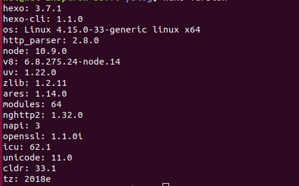
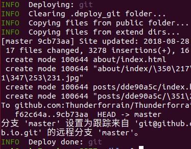

## ** 建议直接看最根本的东西 **

限于本人英语水平有限，建议大家直接到github上阅读相应的仓库获取最新知识，这样能避免很多错误，也不会被网上很多已经过时的东西影响。本人的版本：
### Theme version
version: 5.1.4
 <!-- more -->
### hexo 版本


## 东拼西凑的东西

### 每次输入都需要重新输入github帐号和密码？

参考[设置 SSH 使用 hexo deploy 时免输用户名密码](https://blog.csdn.net/hhgggggg/article/details/77853665)
设置好的状态：

### 版权声明

	之前的版本声明我觉得有点丑，除了有最新更新时间没有别的好处，而且那些声明明显落后于现在版本更新的速度，建议使用新版本里面的简洁声明
 * 打开主题配置文件找到post_copyright
```bash
post_copyright:
  enable: true #将false改成true
  license: CC BY-NC-SA 3.0
  license_url: https://creativecommons.org/licenses/by-nc-sa/3.0/
```
### 设置gitment评论系统

	尝试过valine评论，但是决定作为程序员还是使用gitment比较好
最新版里面不需要添加配置文件只需要有app即可
操作如下：
#### 注册OAuth Application

点击https://github.com/settings/applications/new注册
参数说明：
```bash
Application name：   #应用名称
Homepage URL：  #网站URL
Application description #描述
Authorization callback URL：#网站URL
```
#### 修改themes/next/_config.yml

在其中添加：
```
# Gitment
# Introduction: https://imsun.net/posts/gitment-introduction/
# You can get your Github ID from https://api.github.com/users/<Github username>
gitment:
  enable: true
  mint: true # RECOMMEND, A mint on Gitment, to support count, language and proxy_gateway
  count: true # Show comments count in post meta area
  lazy: false # Comments lazy loading with a button
  cleanly: false # Hide 'Powered by ...' on footer, and more
  language: 不添加则跟随默认语言# Force language, or auto switch by theme跟随默认语言
  github_user: Github名 # MUST HAVE, Your Github ID
  github_repo: .github.io的仓库 # MUST HAVE, The repo you use to store Gitment comments
  client_id:  App id # MUST HAVE, Github client id for the Gitment
  client_secret: App secret # EITHER this or proxy_gateway, Github access secret token for the Gitment
  proxy_gateway: # Address of api proxy, See: https://github.com/aimingoo/intersect
  redirect_protocol: # Protocol of redirect_uri with force_redirect_protocol when mint enabled

```

### 链接消除汉语

在文章量不是很大的情况下建议直接设置链接的英文名，网上有相关教程
我采用了转换，但是出了些小bug，但还能应付的过来

### 关于用自己的页面做页面

请参考jacklightChen[Hexo-用自己的页面做首页](blog.lightina.cn/2016/10/27/HexoOverview/)

### 主题内添加相册功能（可能会出现卡顿）

请参考asdfv1929[Hexo NexT主题内添加相册功能](https://asdfv1929.github.io/2018/05/26/next-add-photos/)

### 添加网页标题崩溃欺骗搞怪特效

请参考asdfv1929[Hexo NexT主题中添加网页标题崩溃欺骗搞怪特效](https://asdfv1929.github.io/2018/01/25/crash-cheat/)

### 添加加载效果
打开主题配置文件搜索pace_theme看到下面这些效果，有很多种，挑选一个自己喜欢的就好了
```
# Progress bar in the top during page loading.
pace: true
# Themes list:
#pace-theme-big-counter
#pace-theme-bounce
#pace-theme-barber-shop
#pace-theme-center-atom
#pace-theme-center-circle
#pace-theme-center-radar
#pace-theme-center-simple
#pace-theme-corner-indicator
#pace-theme-fill-left
#pace-theme-flash
#pace-theme-loading-bar
#pace-theme-mac-osx
#pace-theme-minimal
# For example
# pace_theme: pace-theme-center-simple
pace_theme: pace-theme-loading-bar
```


## 最后
> 鉴于很多大佬都有相应的分享
> 我就老老实实做一个搬运工，希望有更多人能有一个自己满意的博客
> 网上有更多好的效果和实现方式
> 欢迎与我交流     ---->[传送门](https://tfrain.github.io/about/)
