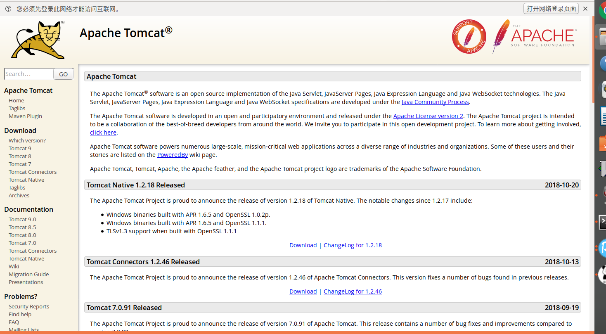
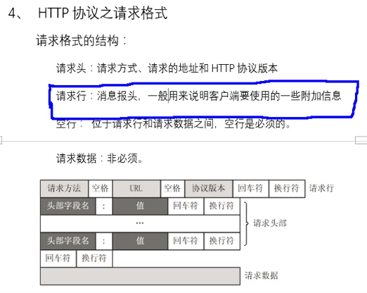
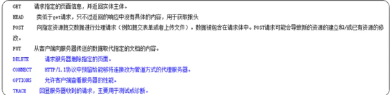
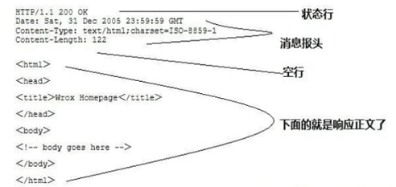
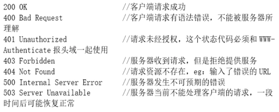
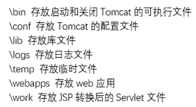
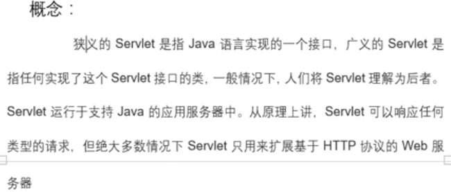
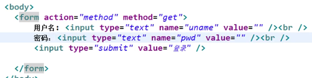
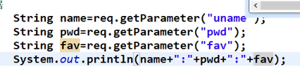
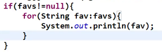

 
<!-- more -->

# http协议：超文本传输协议
## 概念和作用特点
	作用：规范浏览器（客户端）与服务器之间的数据交互
	特点：简单、快捷、灵活、无连接（http1.1后支持可持续连接）、无状态（没有记忆，数据量大，新应答快速）

## 交互流程、请求格式、请求方式
交互流程：
客户端和服务器建立连接
客户端法发送请求到服务器端
服务器端接收到请求后进行处理，然后将处理结果相应客户端
关闭客户端和服务器端的连接（HTTP1.1后不会立即关闭）
请求格式：
结构：请求头、请求行、空行、请求数据
​​
 
请求方式（结构大致一样，方式可能不同）：
HTTP1.0：GET（？后有请求数据，不安全）、POST、HEAD方法
HTTP1.1：OPTIONS、PUT、DELETE、TRACE、CONNECT方法	
​ 
## 响应格式的结构和常见的状态码
响应行（状态行）：HTTP版本、状态码、状态消息
响应头：消息报头、客户端使用的附加信息
空行：响应头和响应实体之间必须的
响应实体：正文，服务器返回浏览器的信息
​​
 
常见的状态码（告诉浏览器）：
​​ 

# 服务器（主流是Tomcat）：
本质：实际上就是java网络编程用代码编写的一个容器
Tomcat目录结构：
​​ 
因为含有class文件，所以一定要依靠jdk，java虚拟环境

# Servlet技术：
## 概念和介绍
> 程序员在编写代码的时候如果能够按照服务器能够识别的规则进行编写，浏览器按照指定的规则进行发送请求（服务器识别就类似于JVM找main（）方法似的，有指定的规则），那么服务器就可以调用并执行响应的逻辑代码进行请求处理了。

​​ 

本质上就是服务器能够识别的接口规范
1.创建普通的java类并继承HttpServlet方法
2.覆写service方法
3.在service方法中书写逻辑代码就行
4.在webRoot下的WEB-INF文件夹下的web.xml文件中配置servlet（确保能找到）
现在很多IDE环境不需要将class文件移交到相应的Tomcat下
## 运行（访问）流程：
URL: http://localhost:8080/01.MyServlet/my2
组成：服务器地址：端口号/服务器下webapps下的文件夹的名称（虚拟项目名）/（servlet的别名）要执行的servlet的url-pattern（因为防止包名类名被黑客利用，需有一定的隐藏，所以采用url-pattern的规则）

URI：虚拟项目名/ servlet的别名
```
<servlet>
  		<servlet-name>my2</servlet-name>
  		<servlet-class>com.bjsxt.servlet.MyServlet2</servlet-class>
  </servlet>
  
  <servlet-mapping>
  		<servlet-name>my2</servlet-name>
  		<url-pattern>/my2</url-pattern>
  </servlet-mapping>
  ```
相当于起一个别名，通过web.xml下找到my2，再找到包类名，找不到则404（my2相当于暗号）
服务器会加载一下本地的文件，删除文件并关闭服务器再打开会提示报错信息

## Servlet生命周期：
1.第一次调用到服务器关闭
2.如果servlet在web.xml中配置了load-on-startup之间的数字表示顺序，生命周期为从服务器启动到服务器关闭
3.注意：
Init方法是对servlet进行初始化的一个方法，会在servlet第一次加载进行存储时进行
Destroy方法是在servlet销毁时执行

Jsp中的表单数据：
​​ 
## Service和doGet和doPost方法的区别：
> Service方法:可以处理get、post方式的请求，如果servlet中包含service方法，优先调用service方法对请求进行处理
	doGet方法:处理get方式的请求
	doPost方法:处理post方式的请求
注意：
如果在覆写的service方法中调用了父类的service方法（super.service（arg0,arg1））,则service方法处理后，会再次根据请求方式响应的doGet和doPost方法执行。一般情况下，不在service中调用父类的service方法，避免出现405错误

## Servlet常见错误：
404错误：资源未找到
在请求地址中的servlet的别名书写错误
虚拟项目名称拼写错误
500错误：不可预估的错误
在web.xml中校验servlet类的全限定路径是否拼写错误。
service方法体的代码执行错误所致，根据错误提示对service方法体中的代码进行更改
405错误：请求方式不支持
请求方式和servlet中的方法不匹配所导致的，尽量使用service方法进行请求处理，并且不要在service方法中调用父类的service。

# Request对象：
## 介绍和获取请求头信息
> 服务器接收到浏览器的请求后，会创建一个request对象，对象中存储了此次请求相关的请求数据。服务器在调用servlet时会将创建好的request对象作为实参传递给servlet的方法，比如service方法。

使用：获取请求头数据、请求行数据、用户数据
作用：request对象中封存了当前请求的多有请求信息
注意：request对象由Tomcat服务器创建，并作为实参传递给处理请求的servlet的service方法

Service中的形参以req为例子
## 获取请求头数据：
获取请求方式
```
		String method = req.getMethod();
		Sout(method);
```
获取请求URL
```
		StringBuffer url = req.getRequestURL()l;
		Sout(url);
```
获取URI
```
		String uri = req.getRequestURI();
		Sout(uri);
```
获取协议
```
		String h = req.getScheme();
		Sout(h);
```
## 获取请求行数据;
获取指定的请求行信息
```
	String value = req.getHeader(“User-Agent”);//根据F12浏览器端找到的键值，加入想要获取666但是你没有，那么你在控制台后收到null
```
获取所有的请求行的键的枚举
```
	Enumeration e = req.getHeaderNames();
	while(e.hasMoreElements()){
```
获取所有键值
```
	sout(e.nextElement());
```
获取所有信息
```
	String name = (String)e. nextElement();
	String value2= req.getHeader(name);
	Sout(name+”:”+value2);
```
## 获取用户数据：
req.getParameter(“键名”);(返回指定的用户数据，不能获得同键不同值的多项选择数据，会漏值)
 
​​
 避免漏值
​​ 
```
req.getParameterValue(“键名”);(返回同键不同值的请求数据（多选），返回数组)
req.getParameterNames(“键名”);(返回所有请求数据的枚举集合)
```

注意：如过要获取的请求数据不存在，不会报错，返回null。

## request对象学习
问题：在使用request对象获取请求数据并进行处理后，处理的结果如何显示到浏览器中？

总结：
Service请求处理代码流程：设置响应编码格式、获取请求数据、处理请求数据、数据库操作（MVC思想）、响应处理结果
响应实体里面可以设置具体的html代码（无JSP的麻烦之处）

乱码问题：记得服务器到浏览器，浏览器到服务器两个半流程中的编码规范问题
servlet流程总结：

## Request作用域
问题：使用请求转发后，不同的servlet之间怎么进行数据共享呢？或者说数据怎么从一个servlet流转给另外一个servlet呢？
解决：使用request对象的作用域

# 请求转发：
问题：服务器在接收到浏览器的请求后，仅仅使用一个servlet进行请求处理，会造成不同的servlet逻辑代码冗余，servlet的职责不明确
解决：使用请求转发
特点：一次请求、地址栏信息不改变


# 重定向学习
问题：如果当前的请求servlet无法处理怎么办？如果使用请求转发，造成表单数据重复提交怎么办？
解决：使用重定向


# Cookie学习
## Cookie介绍、使用、设置有效期、信息获取


## Cookie三天免登录


# session学习
## session介绍及原理
问题：request对象解决了一次请求内的不同servlet的数据共享问题，那么一个用户的不同请求的处理需要使用相同的数据怎么办呢？
解决：使用session技术
原理：
用户使用浏览器第一次向服务器发送请求，服务器在接收到请求后，调用响应的servlet进行处理。在处理过程中会给用户创建一个session对象，用来存储用户请求处理相关的公共数据，并将此session对象的JSESSIONID以cookie的形式存储在浏览器中（临时存储，浏览器关闭即失效）。用户在发起第二次请求及后续请求能够获取同一个session对象，也保证了不同请求能够获取到共享的数据。
## session特点及使用
特点：存储在服务器端、服务器进行创建、依赖cookie技术、一次会话
作用：解决了一个用户不同请求的数据共享问题
使用：
### 创建session对象/获取session对象

### 设置session存储时间（一般为30分钟）

### 设置session强制失效
hs.invalidate();
### 注意
JSESSIONID以cookie的形式存储在浏览器中（临时存储，浏览器关闭即失效）
## session数据流转和总结
存储和获取数据

使用时机：一般用户在登录web项目时会将用户的个人信息存储到session中，供该用户的其他请求使用
总结：session解决了有个用户的不同请求的数据共享问题，只要在JSESSIONID不失效和session对象不失效的情况下，用户的任意请求在处理时都能获取到同一个session对象。
作用域：一次会话（在JSESSIONID不失效和session对象不失效的情况下为整个项目内）
session失效处理：将用户请求中的JSESSIONID和后台获取到的session对象JSESSIONID进行对比，如果一致则session没有失效，否则证明session失效了。重定向到登录界面，让用户重新登录。
## 解决主页面用户名显示为null的问题
原因：因为在用户登录成功后使用重定向显示主页面，两次请求，而用户的信息在第一次请求中，第二次请求中没有用户数据，所以显示为null
解决：使用session

# ServletContext对象学习
问题：request解决了一次请求内的数据共享问题，session解决了用户不同请求的数据共享问题，那么不同的用户的数据共享该怎么办呢？
解决：使用ServletContext对象
作用：解决了不同用户的数据共享问题
原理：ServletContext对象由服务器进行创建，一个项目只有一个对象。不管在项目的任意位置进行获取得到的都是同一个对象，那么不同用户发起请求获取到的也就是同一个对象了，该对象由用户共同拥有
特点：服务器创建、用户共享、一个项目只有一个
生命周期：服务器启动到关闭
作用域：项目内
使用：
获取ServletContext对象/使用ServletContext对象完成数据共享

获取项目中web.xml文件中的全局配置数据

获取项目webroot下的资源的绝对路径/流对象

使用ServletContext对象完成网页计数器
在用户登录校验中创建计数器并自增，然后存储到ServletContext对象中，在主页面中取出计数器数据并显示给用户即可

# ServletConfig对象
问题：使用ServletConfig对象可以获取web.xml中的全局配置文件，在web.xml中每个servlet也可以进行单独的配置，那么该怎么获取配置信息呢？
解决：使用ServletConfig对象
作用：ServletConfig对象是servlet的专属配置对象，每个servlet都单独拥有一个ServletConfig对象用来获取web.xml中的配置信息
使用：


# web.xml文件
作用：存储项目相关的配置信息，保护servlet。解耦一些数据对程序的依赖
使用位置：每个web项目中、tomcat服务器中（在服务器目录conf目录中）
区别：
web项目下的web.xml文件为局部配置，针对本项目的位置
tomcat下的web.xml文件为全局配置，配置公共信息
内容（核心组件）：全局上下文配置（全局配置参数）、servlet配置、过滤器配置、监听器配置
加载顺序：
web容器会按照ServletContext->context-param->listener->filter->servlet这个顺序加载组件，这些元素可配置在web.xml中的任意位置
加载时机：服务器启动时

# server.xml文件
问题：
浏览器发起请求后服务器根据请求在webapps目录下调用对应的servlet进行请求处理。那么为什么是webapps目录而不是其他的目录呢？
解决：了解server.xml文件的配置信息
server.xml文件核心组件：

热部署：
```
<Context path="/Pet" reloadable="false" docBase="F:/PetWeb" />
```
> 参考链接：
[B站](https://www.bilibili.com/video/av33969622/?p=1)
[菜鸟教程](http://www.runoob.com/servlet/servlet-tutorial.html)